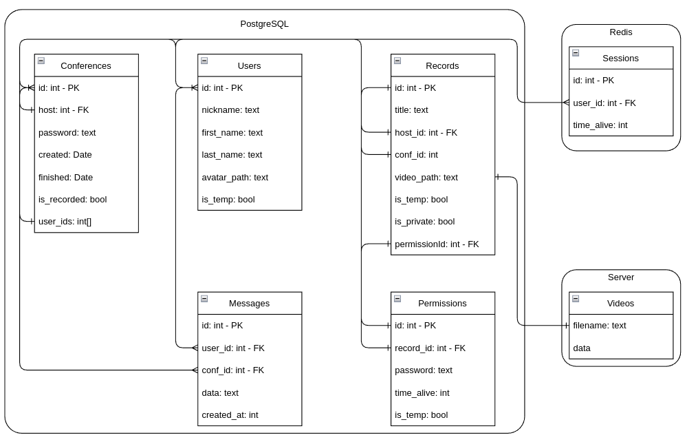
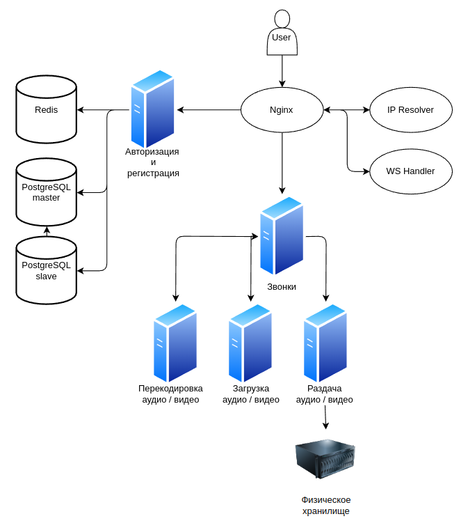

# Курс "Проектирование высоконагруженных систем"

**Тема курсовой работы:**
Проектирование сервиса видеозвонков *Zoom*

## Введение в предметую область

[Zoom](https://ru.wikipedia.org/wiki/Zoom_(%D0%BF%D1%80%D0%BE%D0%B3%D1%80%D0%B0%D0%BC%D0%BC%D0%B0)) - проприетарная программа для организации видеоконференций, разработанная компанией Zoom Video Communications. Она предоставляет сервис видеотелефонии, который позволяет подключать одновременно до 100 устройств бесплатно, с 40-минутным ограничением для бесплатных аккаунтов.

В работе акцент будет сосредоточен на возможностях создания видеозвонков.

## Целевая аудитория

На декабрь 2020 года [[1.1]](#source-1) в ежедневных видеовстречах принимали участие около 350 миллионов пользователей.
К 2022 году месячная аудитория сайта zoom.us в России была около 23 миллионов пользователей [[1.2]](#source-1).

Учитывая статистику 2021 года и то, что в СНГ приблизительно 2% пользователей Zoom можно высчитать, что количество пользователей = 350 × 0.02 ~= 7 млн..
Это число показывает ежедневную аудиторию сервиса, однако, это не уникальные инспользования. Один человек может несколько раз участвовать в конференции.
Пусть каждый человек в среднем делает по 3 звонка. Тогда 7 / 3 ~= 2 млн => в СНГ ежедневная нагрузка сервиса может достигать 2 млн пользователей.

Таким образом, целевая аудитория для проектируемого сервиса следующая:
- Страны СНГ;
- Пользователи в возрасте 18 - 50 лет;

Сводная таблица:
| Месячная аудитория в СНГ | Еждневная нагрузка (кол-во сессий) | Дневная нагрузка по пользователям |
|--------------------------|------------------------------------|-----------------------------------|
| 23 млн                    | 7 млн                              | 2 млн                             |

## Минимально жизнеспособный продукт
Минимальные требования для MVP:
- возможность авторизации и регистрации;
- возможность создавать видеоконференции с требованиями:
    - связь по видео и / или аудио;
    - наличие текстового чата для всех участников (с возможностью отправлять сообщения для отдельный участников);
    - возможность создать запись видеоконференций;
    - возможность добавлять / удалять участников (максимальное количество - 50)
- возможность вступать в видеоконференцию по ссылке

## Нагрузка
Для расчёта нагрузки опишем продуктовые и технические метрики, которые определять все необходимые числа.
### Продуктовые метрики
Рассмотрим такие продуктовые метрики, как месячная и дневная аудитория, предполагаемые средние количества действий пользователя за день, а также предполагаемый средний объём данных, которые занимает пользователь.

1. Месячная аудитория - 23 млн. чел. (см выше)
2. Дневная аудитория - 2 млн. чел.
Из этого следует: 2 × 30 = 60 млн. чел пользователей в месяц, но уникальных из них 23, поэтому средний пользователь заходит примерно 3 раза в месяц.
3. Рассмотрим такие действия, как:
    - Авторизация / регистрация: 10 раз в месяц, т.е. 0.333 в день.
    - Создание конференции: 1 раз в день 3 раза в месяц (т.е. 3 раз в месяц).
    - Присоединение к конференции: 2 раза в день 3 раза в месяц (6 раз в месяц в среднем по часу в день).
    - Отправка сообщений в чат: 10 сообщений за конференцию, т.е. 20 в день (180 в месяц)
    - Сохранение записей: в среднем 5 записей в месяц, 0.16 записей в день
4. Средний размер хранилища на одного пользователя:
    - Фото польователя и персональная информация - 1 Мб
    - Записи конференций: 5 записей приблизительно равны 5 часам видео в месяц. 1 час видео в формате HD занимает примерно 1 Гб, т.е.  5 Гб в месяц
    - Планирование конференций, информация о ссылках и т.п. - 500 символов на запись, в UTF-8 500 × 2 = 1000 байт

### Оценка аудитории
Для определённой выше целевой аудитории предполагаемые оценки равны:
- Дневная аудитория: примерно 2 млн. уникальных пользователей
- Месячная аудитория: 24 миллиона пользователей

### Технические метрики
<ins>Примечание:</ins> пусть
- в 1 конференции чат содержит в среднем 25000 символов или 4250 слов (в среднем 6 символов слово)
- строки хранятся в формате UTF-8 => 1 символ занимает 2 байта (СНГ, поэтому кириллица).
- в 1 сообщении 25 символов.
- считаем, что сервисом пользуется 25 миллионов пользователей.
- одна сессия занимает 16 + 8 байт = 24 байта (sessionID, userID)
- один звонок (информация об участниках конференции) - 16 + 16 + 16 + 8 × 3 ~= 72 (id, таймстемпы начала и конца, userIDs) байта на запись.
- пользователь в среднем 60 % времени конференции использует видеокамеру и 40% времени аудио
- средняя длительность 1 звонка = 54 минуты [[1.3]](#source-3), округлим до 1 часа

На основе вышеперечисленных данных определим размер требуемого хранилища, средний и пиковый сетевой трафики, а также RPS для описанных выше действий пользователя.

1. Требуемый размер хранилища данных:
  - Персональные данные (профиль) = 25.000.000 × 1 Мб = 23.84 Тб
  - Записи конференций = 5 Гб × 12 × 7.000.000 = 0.4 миллиона Тб за год
  - Записи чатов = 7.000.000 × 2(кол-во конференций в день) × 365 ×  25 000 × 2 ~= 31 ТБ за год
  - Хранилище сессий: 2 000 000 × 24 × 2 × 0.5 = 46 МБ.
  - Хранилища звонков: 2 000 000 × 72 байта × 365 ~= 49 ГБ в год.

1. Средний сетевой трафик

- По данным официального сайта Zoom [[1.4]](#source-4), для видео формата HD пропускная способность должна быть 1.8 МБит/с на загрузку, FULL HD - 3 МБит/с -> возьмем среднее (1.8 + 3) / 2 = 2.4 Мбит/с на пользователя
- 1 конференция длится 1 час -> пропускная способность на пользователя 2.4 × 3600 = 8640 Мбит/час = 8.64 ГБит/час
- Для всех пользователей: 7 000 000 × 8.64 × 0.6 = 36 228 000 ГБит/ч (примечание: используется число 0.6, т.к. 60% времени используется видео)
- Передача аудио = 16 Кбит/с × 10^(-6) × 7 000 000 × 3600 × 0.4 = 161 080 Гбит/ч
- Сохранение записи в облаке: По данным официального сайта Zoom [[1.4]](#source-4), на HD видео скорость выгрузки должна быть не менее 1.2 МБ/с
- Для всех пользователей: 1.25 Мбит/с × 10^-3 × 7 000 000 × 0.16 = 1400 Гбит/ч

1. Пиковый сетевой трафик. Предположим, что в пиковый час нагрузка составляет 30% от дневной нагрузки, т.е. 2100 тысяч человек.
- 80 % времени используется видео и звук.
- Пиковая нагрузка: 8.64 × 2100 000 × 2ч / 24ч × 0.8 + 16 Кбит/с × 10^(-6) × 600 000 × 2ч / 24ч × 3600 × 0.6 + 1.25 Мбит/с × 10^-3 × 600 000 × 2ч / 24ч × 0.16 = 4.18 × 10^5 ГБит/ч = 409 ГБит/с

4. RPS при разбивке, соответствующей описанным выше действиям

RPS можно посчитать по одной из следующих формул:

{число заходов на страницу одного человека} × 2 000 000 { число пользователь в день } / 24 / 60 / 60 - если RPS действия зависит от числа пользователей;

{число заходов на страницу одного человека} × 7 000 000 { число сессий в день } / 24 / 60 / 60 - если RPS действия зависит от числа сессий;

- Регистрация и авторизация: 2 000 000 × 0.33 / 24 / 60 / 60 = 8 rps
- Создание и удаление конференции: 2 000 000 × 0.1 × 2 / 24 / 60 / 60 = 5 rps
- Участие в конференции: 7 000 000 × 0.2 × (2 {получение звука и видео}) × 2 {присоединение, отсоединение} / 24 / 60 / 60 = 37 rps
- Редактирование профиля: 2 000 000 × 0.1 / 24 / 60 / 60 = 2.3 rps
- Сохранение видеозаписи: 7 000 000 × 0.16 / 24 / 60 / 60 = 13 rps
- Отправка сообщений в чат: 7 000 000 × 20 / 24 / 60 / 60 = 1610 rps

Суммарно: 516 rps

## Логическая база данных

## Физическая схема

Данные о пользователях, конференциях, записях, сообщениях и доступах, будут хратиться при помощи СУБД, например, PostgreSQL.

Для создания и хранения сессий понадобится быстрое хранилище (в котором операции создания и получения будут особенно быстры), по типу Redis или Tarantool.

Видеозаписи конференций будут храниться на сервере с достаточным объёмом памяти, напирмер, HDD-памяти.

## Технологии

### Фронденд

Для фронденда можно использовать такие фреймворки, как React.js или Vue.js, которые являются одними из самых популярных фронденд-фреймворков за последние годы, поскольку обеспечивают высокую скорость работы приложения благодаря технологии Virtual DOM (Document Object Model), а также переиспользуемость написанных компонентов.

### Бэкенд

Для бэкенда прекрасно подойдёт микросервисная архитектура, т.к. она повзоляет эффективно разделять разработку между несколькими командами разработчиков, обеспечивает высокую отказоустойчивость получившейся системы, а также упрощает горизонтальное масштабирование, что является необходимым для такого сервиса.

Для реализации можно выбрать язык Go, поскольку он прост, популярен в 2022 году, имеет множество готовых библиотек, упрощающих жизнь разработчиков и ускоряющих процесс реализации, а также имеет встроенные горутины и каналы, которые позволяют эффективно распараллеливать производимые вычисления.

Для взаимодействия микросервисов между собой можно использовать протокол grpc, так как он является быстрым в силу того, что использует бинарную передачу данных.

Ниже представлено возможное разбиение итогового сервиса видеозвонков на сервисы и микросервисы.

Можно выделить 2 основных сервиса:
1) авторизация и регистрация;
2) звонки.

Сервис звонков в свою очередь можно поделить на 3 микросервиса:
1) загрузка аудио и / или видео;
2) перекодировка аудио и / или видео;
3) раздача аудио и / или видео;

Взаимодейстие сервера и клиента во время звонка будет устроено следующим образом: сервер принимает видео и аудио от каждого пользователя, и если конкретный пользователь может позволить себе принимать информацию, то сервер будет передавать её напрямую, а если у пользователя есть проблемы с соединением, то сервер будет менять кодировку видео или аудио и передавать пользователю данные пониженного качества.

Также можно учесть оптимизации, такие, как экономия трафика при выключенном микрофоне или низком уровне шумов и оптимизация видео под определённый формат (можно значительно понижать видео для его отображения в маленьком окошке).

Для видео лучше будет использовать формат H.264, так как он поддерживается почти всеми устройствами,  не очень требоватен к батарее и имеет хорошую степень сжатия [[2.1]](#source-6).

### База данных

Для основных данных следует использовать СУБД PostgreSQL, т.к. она отлично подходит для текущей нагрузки, имеет открытый исходный код и крупное сообщество разработчиков.

Для хранения сессий лучше всего использовать быстрое key-value хранилище, такое, как Redis или Tarantool, а видеозаписи стоит хранить на физическом сервере.

### Балансировка нагрузки

Используем Nginx для балансировки нагрузки (а также в качестве reverse-proxy)

## Итоговая схема сервиса

Все вызовы API, вся связь между компонентами и т.д. будут происходить по TCP, но вся передача видео будет происходить по UDP.

## Сервера

#### Физический сервер
Хранение и просмотр записей конференций будет осуществляться с помощью физических серверов с большими дисковыми хранилищами.

Микросервис загрузки видео будет сохранять записи в хранилище и записывать ссылку в БД.

По данным, приведённым выше, файлы занимают примерно 400 ПБ.

Для ускорения доступа можно сделать реплику хранилища в Азиатской части России. Создавать дополнительные реплики нецелесообразно, т.к. при таком объеме хранилища цена будет очень высокой.

#### Отказоустойчивость

Репликация в другой регион обеспечит сохранность файлов и возможность переключения на реплику в случае выхода из строя главного хранилища.

В случае полного отказа, основные функции сервиса продолжат работать (но нельзя будет отправить и загрузить файлы)

### Сервер с данными (Postgres)

RAM
* Необходимо достаточно большое кол-во RAM

Storage
* 1 ТБ - размер базы

| Параметр   | Значение |
| :----:     |      :---|
| CPU        | 8 ядер      |
| RAM        | 16 ГБ     |
| Storage    | 1 ТБ (2 RAID1) |

#### Географическое распределение

Сервер с главной БД стоит разместить в Европе, т.к. там наибольшее число пользователей.

#### Отказоустойчивость

В каждом регионе минимум 2 базы, разместим их в разных дата-центрах.

RAID1 защитит от выхода из строя 1 накопителя.

В случае падения "главной" базы данных произойдет переключение на одну из реплик.

### Redis

Redis явдяется in-memory хранилищем, следовательно требуется большой объём оперативной памяти.

| Параметр | Значение|
| :-: | :-: |
| CPU (cores) | 2 |
| RAM (Gb) | 32 |
| HDD (Gb) | 20 |

### Голосовые сервера

CPU:
* Перекодирование голоса - требовательная операция к CPU, поэтому необходимо большое кол-во ядер.

RAM:
* Перекодирование не требует большого объема RAM

Storage:
* Перекодирование не требует большого хранилища

Network:
* Общая сетевая нагрузка от голосовых потоков: 9 × 2 = 18 ГБит/с
* Обеспечим запас в 25%: 18 × 0.25 = 4.5 ГБит/с
* Итого: 23 Гбит/c

| Параметр   | Значение |
| :----:     |      :---|
| CPU       | 16 ядер      |
| RAM        | 2 ГБ     |
| Storage    | 40 ГБ    |
| Network    | 10 Гбит/с |

#### Географическое распределение

Сервера можно равномерно распределить по регионам, в зависимости от процента пользователей.

#### Отказоустойчивость

При отказе сервера, микросервис звонков распределит нагрузку на другие сервера.

#### Количество серверов

Нам потребуется 23 / 10 ~= 3 сервера

### Сервера трансляций (отправка. кодирование. раскодирование)
CPU.

Кодирование голоса и видео - требовательная операция к CPU, поэтому необходимо большое кол-во ядер.
Кодирование вынесем на машины пользователей.
<!--
По бенчмаркам библиотеки для кодирования видеопотоков H.264 - x264 [[3.1]](#source-3-1) 64 ядерный процессор в среднем обрабатывает 200 кадров в секунду видео в формате 1920х1080.
Максимальное качество видео трансляции - 1920x1080@60, следовательно, для достижения этого показателя достаточно использовать мощности 1/3 процессора (с запасом).
 -->
Тогда, на 1 пользователя требуется 1 поток на отправку и прием (можно запускать в горутинах), 1 поток на декодирование.
В пике 2100 000 пользователей => 2 × 600 000 = 4200 000 потоков
На сервер с 64 ядрами(х2), уйдет 4200 000 / (64 × 2) = 32 812 серверов

RAM.

Перекодирование не требует большого объема RAM.

Storage

Перекодирование не требует большого хранилища.

| Параметр   | Значение |
| :----:     |      :---|
| CPU       | 64(x2) ядра  |
| RAM        | 4 ГБ |
| Storage    | 20 ГБ |

#### Географическое распределение

Сервера можно равномерно распределить по регионам, в зависимости от процента пользователей.

#### Отказоустойчивость

При отказе сервера, микросервис трансляций распределит нагрузку на другие сервера.

#### Количество серверов

Нам потребуется = 32 812 серверов

### Nginx

CPU:
* 888 RPS
* 2-х ядер [хватит](https://www.nginx.com/blog/testing-the-performance-of-nginx-and-nginx-plus-web-servers/)

Network
Расчитаем конфигурацию согласно самому нагруженному, т.е. 20% от нагрузки, с запасом будет 25%.

Пиковая нагрузка - 409 ГБит/с

409 Гбит/c / 2 регионов = 204 Гбит/с на регион

| Параметр   | Значение |
| :----:     |      :---|
| CPU        | 2 ядра |
| RAM        | 2 ГБ  |
| Storage    | 40 ГБ  |
| Network    | 2 Гбит/с |

Нагрузка между серверами будет балансироваться с помощью Cloudflare DNS load balancing.

#### Географическое распределение

В каждом регионе по 30 серверов, подходящий сервер будет выбираться DNS балансером.

На регион по 30 серверов.

#### Отказоустойчивость

30 серверов в каждом регионе, можно разделить их на 2 дата-центра.

[Health monitoring](https://www.cloudflare.com/load-balancing/) серверов, прекращение нагрузки на отказавший сервер.

#### Количество серверов

30 × 2 = 60 серверов

### Микросервисы

Данные сервера подвергаются сравнительно небольшой нагрузке и не требуют больших ресурсов.

| Параметр   | Значение |
| :----:     |      :---|
| CPU        | 2 ядра |
| RAM        | 2 ГБ  |
| Storage    | 40 ГБ  |
| Network    | 100 Мбит/с / 40 Гбит/с|

_Серверу звонков необходимо 40 Гбит/с пропускной способности, т.к. через него будут проходить видео потоки и файлы_

#### Географическое распределение

Разместим в каждом регионе по 2 сервера на каждый микросервис и увеличим кол-во по мере необходимости.

Нагрузка в регионе будет распределяться с помощью nginx.

#### Отказоустойчивость

Размещение в 2-х дата-центрах.

nginx перестанет направлять запросы на отказавший сервер.

#### Количество серверов

5 микросервисов × 2 × 2 региона = 20 серверов
### Сводная таблица

| Сервер                 | Всего |
| :----:                 | :----:
| Postgres           | 4   |
| Голосовые сервера  | 4  |
| Сервера трансляций | 9375 |
| Redis  | 2  |
| Nginx              | 60  |
| Микросервисы       | 20   |

## Использованные источники
1. [Статистические данные по zoom декабрь 2020](https://www.businessofapps.com/data/zoom-statistics/)
2. [Месячная статистика помещаемости в РФ](https://www.statista.com/statistics/1117659/average-traffic-on-remote-working-platforms-in-russia/)
3. [Данные по использованию Zoom в 2021](https://blog.zoom.us/how-you-zoomed-over-the-past-year-2021/)
4. [Системные требования Zoom для ОС Windows, macOS и Linux
](https://support.zoom.us/hc/ru/articles/201362023-%D0%A1%D0%B8%D1%81%D1%82%D0%B5%D0%BC%D0%BD%D1%8B%D0%B5-%D1%82%D1%80%D0%B5%D0%B1%D0%BE%D0%B2%D0%B0%D0%BD%D0%B8%D1%8F-Zoom-%D0%B4%D0%BB%D1%8F-%D0%9E%D0%A1-Windows-macOS-%D0%B8-Linux)
5. [Zoom UserStats: How Many People Use Zoom in 2022? (доступно только с VPN)](https://backlinko.com/zoom-users)
6. [H.264](https://medium.com/@brandonaaskov/vp8-vs-h-264-originally-written-posted-on-may-19-2014-3b432d58abaa)
7. [x264 бенчмарки](https://openbenchmarking.org/test/pts/x264)
